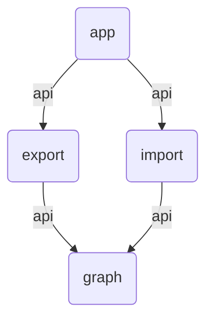

# Dependency Graph Analyser

Analyse and visualise module dependencies in Gradle projects.

__Note:__ This CLI tool is still in development, features and argument may change.

In large and complex Gradle projects with many modules and dependencies it is sometimes hard to keep
an overview. This CLI tool analyses such projects and generates
nice [Mermaid](https://mermaid.js.org/) graphs.

Features:

* Analyse Gradle projects with Kotlin or Groovy DSL

## Usage

```
./gradlew install
./app/build/install/app/bin/app --mermaid-graph .
Analyse settings.gradle.kts
     4 modules
     4 dependencies (1 unique)
graph TD
    vd2a57d(app) -->|api| vb25074(export)
    vd2a57d(app) -->|api| v93473a(import)
    vb25074(export) -->|api| vf8b0b9(graph)
    v93473a(import) -->|api| vf8b0b9(graph)
```

The output is compatible with Mermaids graph schema and can be visualised e.g. in Markdown files.


