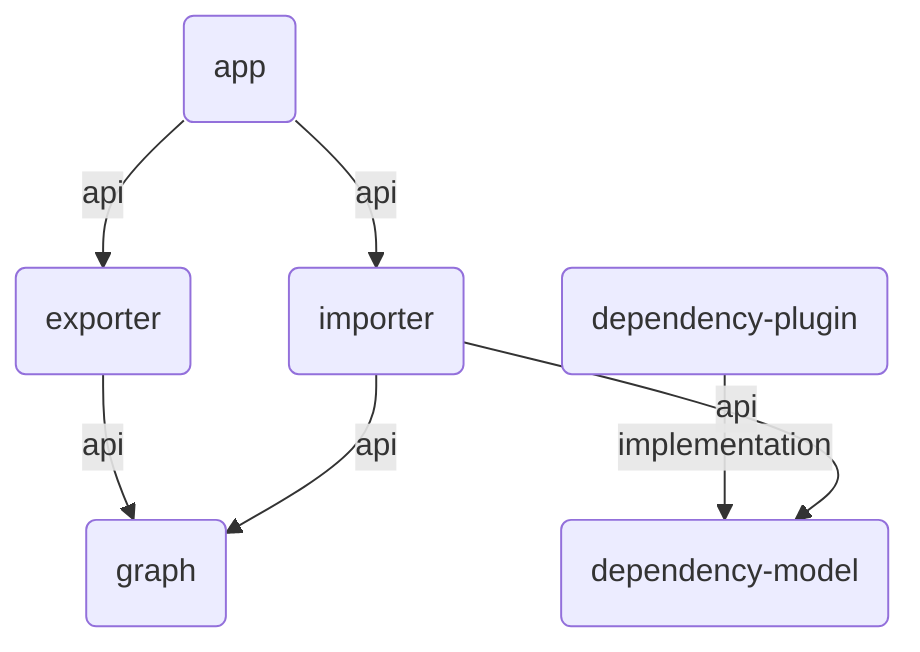

# DGA: Dependency Graph Analyser

Analyse and visualise module dependencies in Gradle projects.

In large and complex Gradle projects with many dependencies between the modules, it is sometimes
difficult to keep track of everything. `dga` can analyse such projects and visualise the
dependencies between the individual modules with the help of [Mermaid](https://mermaid.js.org/).



Features:

* Analyses Gradle projects in both DSLs (Kotlin and Groovy)
* Summarises the project modules and dependencies in figures
* Generates text-based graphs which are compatible with Mermaid charts

## Usage

Print the CLI help with `dga --help`:

```
dga --help
Usage: dga [<options>] <gradleproject>

  Analyse the module dependency graph of a Gradle project.

Options:
  --chart-mermaid   Generate text chart that can be visualised by Mermaid
  --modules         Shows all modules ordered alphabetically
  --configurations  Shows all configurations ordered by occurrence
  -h, --help        Show this message and exit

Arguments:
  <gradleproject>  Path of the Gradle project directory
```

### Quick Start

Download and setup this project:

```
git clone https://github.com/ryru/dependency-graph-analyser.git
cd dependency-graph-analyser/
./gradlew clean install
./gradlew :dependency-plugin:publishToMavenLocal
```

1. Download the GitHub code repository
2. Change into code directory
3. Make a clean installation of the application (application will be available in the
   directory `./app/build/install/dga/bin/dga`)
4. Publish the Gradle tooling API plugin and its data model to Maven local (available in the
   directory `~/.m2/repository/ch/addere/dga/`)

Get an overview of this project by running `dga .``:

```
./app/build/install/dga/bin/dga .

Analyse project "dependency-graph-analyser"
     6 modules
     6 dependencies (2 unique)
```

### Create a Mermaid Chart

Use `dga . --chart-mermaid` to generate a Mermaid chart of this project:

```
./app/build/install/dga/bin/dga . --chart-mermaid

Analyse project "dependency-graph-analyser"
     6 modules
     6 dependencies (2 unique)

graph TD
    vd2a57d(app) -->|api| ved7802(exporter)
    vd2a57d(app) -->|api| v1bc49d(importer)
    v80f88a(dependency-plugin) -->|implementation| v8ebf3d(dependency-model)
    ved7802(exporter) -->|api| vf8b0b9(graph)
    v1bc49d(importer) -->|api| v8ebf3d(dependency-model)
    v1bc49d(importer) -->|api| vf8b0b9(graph)
```

## How DGA works

See [HowItWorks.md](HOWITWORKS.md)

## Contribution

Pull requests are welcome! Check [CONTRIBUTING.md](CONTRIBUTING.md) before starting any work.
