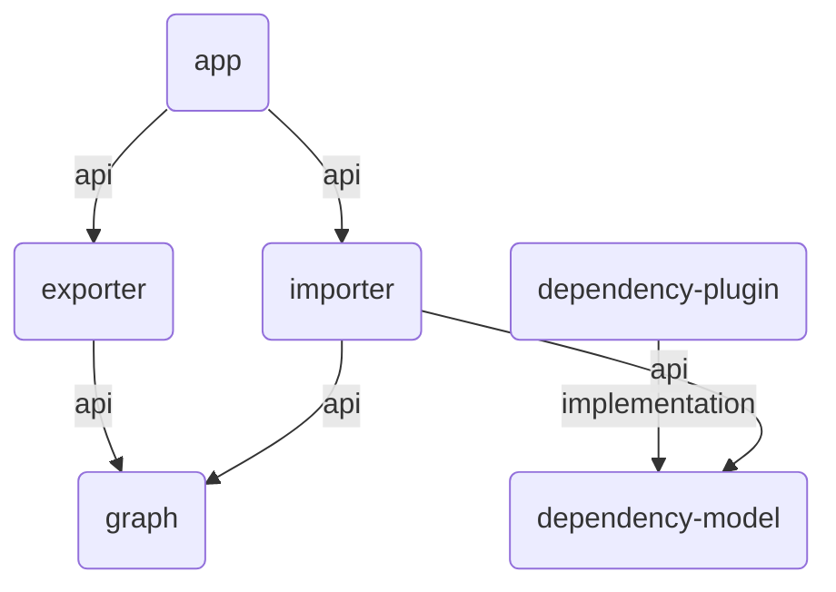

# DGA: Dependency Graph Analyser

Analyse and visualise module dependencies in Gradle projects.

In large and complex Gradle projects with many dependencies between the modules, it can be difficult
to keep track of everything. `dga` can analyse projects and visualise the dependencies between the
individual modules with the help of [Mermaid](https://mermaid.js.org/).



What you see in the above graph:

* _Module_ `app` has two direct _dependencies_: `exporter` and `importer`, both use the
  _configuration_ `api`.
* _Module_ `dependency-plugin` has one direct _dependency_ (`dependency-model`) of
  _configuration_ `implementation`.

Features:

* Analyses Gradle projects in both DSLs (Kotlin and Groovy)
* Summarises the project modules and dependencies
* Generates text-based graphs which are compatible with Mermaid charts
* Filter only relevant modules or configurations

## Usage

Print the CLI help with `dga --help`:

```
dga --help
Usage: dga [<options>] <gradleproject>

  Analyse the module dependency graph of a Gradle project.

Filter Options:

  Filter control what to analyse. If several filters are set, dependencies must fulfill all of them. Without any set filter the whole Gradle project will be processed.

  Use an '*' asterisk to specify multiple modules or configurations without writing each of them.

  E.g.:
   • "importer-*" resolves to all modules starting with 'importer-'.
   • "*-exporter" resolves to all modules ending with '-exporter'.
   • "file-*-exporter" resolves to all modules starting with 'file-' and ending with '-exporter'.

  -m=<module,...>         Module names either in origin or destination. Specify multiple comma-separated module names.
  -o=<module,...>         Module names in origin. Specify multiple comma-separated module names.
  -d=<module,...>         Module names in destination. Specify multiple comma-separated module names.
  -c=<configuration,...>  Configurations used in dependencies. Specify multiple comma-separated configuration names.

Display Options:

  Options controlling how to output the analysed data. Display options can not be combined.

  --modules         Shows all modules of the project applying to the specified filters.
  --configurations  Displays all configurations applying to the specified filters and sorted by frequency of occurrence.
  --chart-mermaid   Generate the Mermaid graph chart source for the dependencies fulfilling the filter criteria.

Options:
  -h, --help  Show this message and exit

Arguments:
  <gradleproject>  Path of the Gradle project directory
```

### Quick Start

Download and setup this project:

```
git clone https://github.com/ryru/dependency-graph-analyser.git
cd dependency-graph-analyser/
./gradlew clean install
./gradlew :dependency-plugin:publishToMavenLocal
```

1. Download the GitHub code repository
2. Change into code directory
3. Make a clean installation of the application (application will be available in the
   directory `./app/build/install/dga/bin/dga`)
4. Publish the Gradle tooling API plugin and its data model to Maven local (available in the
   directory `~/.m2/repository/ch/addere/dga/`)

Get an overview of this project by running `dga .``:

```
./app/build/install/dga/bin/dga .

Analyse project "dependency-graph-analyser"
     6 modules
     6 dependencies (2 unique configurations)

```

### Create a Mermaid Chart

Use `dga . --chart-mermaid` to generate a Mermaid chart of this project:

```
./app/build/install/dga/bin/dga . --chart-mermaid

Analyse project "dependency-graph-analyser"
     6 modules
     6 dependencies (2 unique configurations)

graph TD
    vd2a57d(app) -->|api| ved7802(exporter)
    vd2a57d(app) -->|api| v1bc49d(importer)
    v80f88a(dependency-plugin) -->|implementation| v8ebf3d(dependency-model)
    ved7802(exporter) -->|api| vf8b0b9(graph)
    v1bc49d(importer) -->|api| v8ebf3d(dependency-model)
    v1bc49d(importer) -->|api| vf8b0b9(graph)

```

#### Filter Modules

Use `dga . -o app,exporter --chart-mermaid` to generate a Mermaid chart of this project only
containing the modules `app` and `exporter` in the origin:

```
./app/build/install/dga/bin/dga . -o app,exporter --chart-mermaid

Analyse project "dependency-graph-analyser"
     6 modules
     6 dependencies (2 unique configurations)

graph TD
    vd2a57d(app) -->|api| ved7802(exporter)
    vd2a57d(app) -->|api| v1bc49d(importer)
    ved7802(exporter) -->|api| vf8b0b9(graph)

```

## How DGA works

See [HowItWorks.md](HOWITWORKS.md)

## Contribution

Pull requests are welcome! Check [CONTRIBUTING.md](CONTRIBUTING.md) before starting any work.
