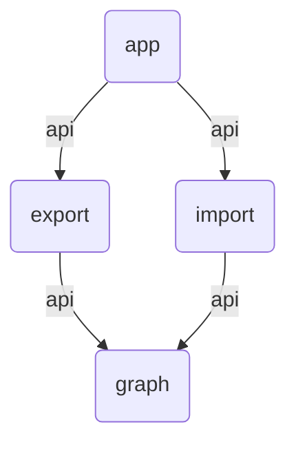

# Dependency Graph Analyser

Analyse and visualise module dependencies in Gradle projects.

In large and complex Gradle projects with many dependencies between the modules, it is sometimes
difficult to keep track of everything. `dga` can analyse such projects and visualise the
dependencies between the individual modules with the help of [Mermaid](https://mermaid.js.org/).

Features:

* Analyses Gradle projects in both DSLs (Kotlin and Groovy)
* Summarises the project modules and dependencies in figures
* Generates text-based graphs which are compatible with Mermaid charts

__Note:__ This CLI tool is still under development, functionality and programme call arguments may
still change.

## Usage

```
./gradlew install
./app/build/install/dga/bin/dga . --mermaid-chart

Analyse settings.gradle.kts
     4 modules
     4 dependencies (1 unique)

graph TD
    vd2a57d(app) -->|api| vb25074(export)
    vd2a57d(app) -->|api| v93473a(import)
    vb25074(export) -->|api| vf8b0b9(graph)
    v93473a(import) -->|api| vf8b0b9(graph)

```

The output is compatible with Mermaids graph schema and can be visualised e.g. in Markdown files.


