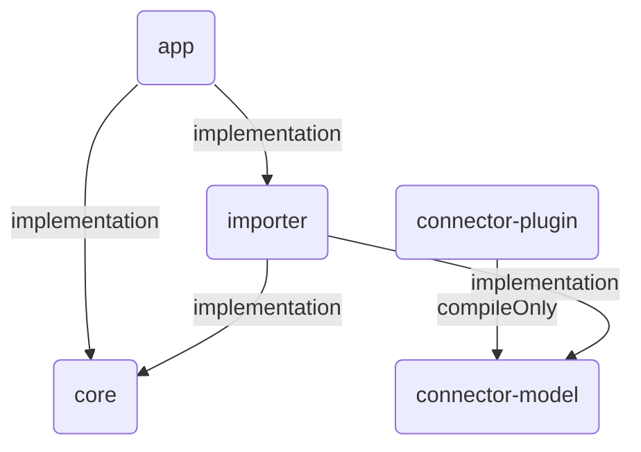

# DGA: Dependency Graph Analyser

[](https://github.com/ryru/dependency-graph-analyser/actions/workflows/build.yml)

Analyse and visualise module dependencies in Gradle projects.

In large and complex Gradle projects with many dependencies between the modules, it can be difficult
to keep track of everything. `dga` can analyse projects and visualise the dependencies between the
individual modules with the help of [Mermaid](https://mermaid.js.org/).



Features:

* Analyses Gradle projects in both Kotlin and Groovy DSLs
* Summarises the project modules and dependencies
* Generates text-based graphs which are compatible with Mermaid charts
* Filter only relevant modules or configurations
* Include transitive project dependencies

## Usage

Print the CLI help with `dga --help`:

```
dga --help
Usage: dga [<options>] <gradleproject>

  Analyse the module dependency graph of a Gradle project.

Filter Options:

  Filter control what to analyse. If several filters are set, dependencies must fulfill all of them. Without any set filter the whole Gradle project will be processed.

  Use an '*' asterisk to specify multiple modules or configurations without writing each of them.

  E.g.:
   • "importer-*" resolves to all modules starting with 'importer-'.
   • "*-exporter" resolves to all modules ending with '-exporter'.
   • "file-*-exporter" resolves to all modules starting with 'file-' and ending with '-exporter'.

  -m=<module,...>         Module names either in origin or destination. Specify multiple comma-separated module names.
  -o=<module,...>         Module names in origin. Specify multiple comma-separated module names.
  -d=<module,...>         Module names in destination. Specify multiple comma-separated module names.
  -c=<configuration,...>  Configurations used in dependencies. Specify multiple comma-separated configuration names.
  -t, --transitive        If set, also include transitive module dependencies. This applies only if a module filter is active.

Display Options:

  Options controlling how to output the analysed data. Display options can not be combined.

  --modules         Shows all modules of the project applying to the specified filters.
  --configurations  Displays all configurations applying to the specified filters and sorted by frequency of occurrence.
  --mermaid-graph   Generate the Mermaid graph chart source for the dependencies fulfilling the filter criteria.
  --chart-mermaid   Generate the Mermaid graph chart source for the dependencies fulfilling the filter criteria. (deprecated)

Options:
  -h, --help  Show this message and exit

Arguments:
  <gradleproject>  Path of the Gradle project directory

```

### Quick Start

Download and setup this project:

```
git clone https://github.com/ryru/dependency-graph-analyser.git
cd dependency-graph-analyser/
./gradlew clean install
```

1. Download the GitHub code repository
2. Change into code directory
3. Make a clean installation of the application (application will be available in the directory
   `./app/build/install/dga/bin/dga`)

Get an overview of this project by running `dga .`:

```
./app/build/install/dga/bin/dga .

Analyse project "dependency-graph-analyser"
     5 modules
     5 dependency configurations (2 unique dependency configurations)
 
```

### Create a Mermaid Chart

Use `dga . --chart-mermaid` to generate a Mermaid chart of this project:

```
./app/build/install/dga/bin/dga . --mermaid-graph

Analyse project "dependency-graph-analyser"
     5 modules
     5 dependency configurations (2 unique dependency configurations)

graph TD
    vd2a57d(app) -->|implementation| va74ad8(core)
    vd2a57d(app) -->|implementation| v1bc49d(importer)
    va02543(connector-plugin) -->|compileOnly| v91bd8e(connector-model)
    v1bc49d(importer) -->|implementation| v91bd8e(connector-model)
    v1bc49d(importer) -->|implementation| va74ad8(core)

```

#### Filter Modules

Use `dga . -o app --mermaid-graph` to generate a Mermaid graph chart of this project only
containing the dependencies originating from the module `app`:

```
./app/build/install/dga/bin/dga . -o app --mermaid-graph

Analyse project "dependency-graph-analyser"
     5 modules
     5 dependency configurations (2 unique dependency configurations)

Applying filter on data results in:
     3 modules
     2 dependency configurations (1 unique dependency configurations)

graph TD
    vd2a57d(app) -->|implementation| va74ad8(core)
    vd2a57d(app) -->|implementation| v1bc49d(importer)

```

- Use `--transitive` to also include transitive dependencies.

## Documentation

See [docs](docs) for project documentation.

## Contribution

Contributions are very welcome! Check [CONTRIBUTING](CONTRIBUTING.md) before starting any work.

## Motivation and goal

I started this hobby project primarily to learn and practice Kotlin, while also deepening my
understanding of Gradle and its build system.

I'm currently working on a medium to large software project consisting of several dozen Gradle
modules. Having recently discovered Mermaid, I thought it would be useful to create a tool that can
visualise and analyse dependencies in larger Gradle projects. The goal of this tool, _DGA_, should
be to help to better understand the relationships between different modules.
