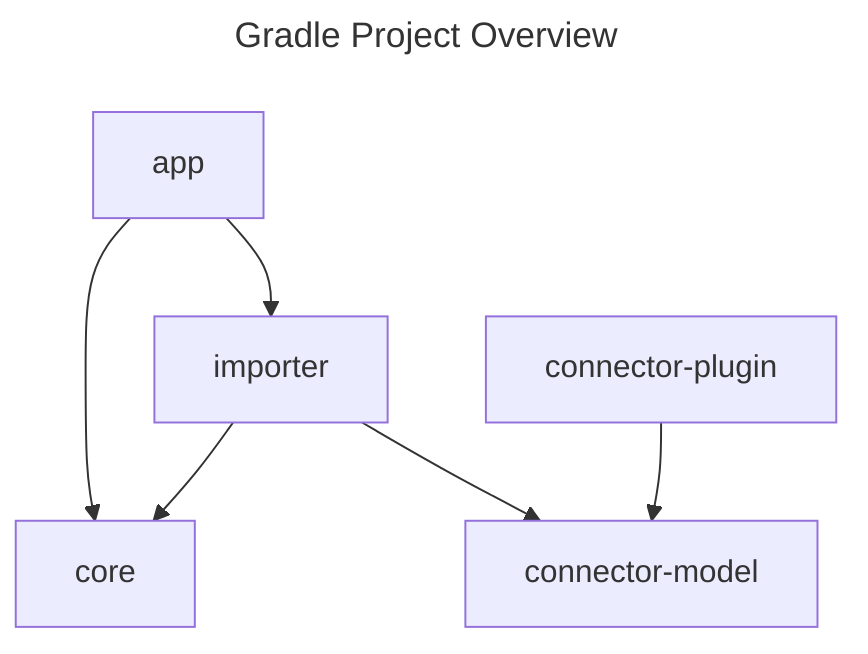

# Architecture

Describes the current software architecture of this project.

- **app**: Contains the CLI application that parses the input, starts the dependency injection
  modules and prints the output.
- **core**: Contains the core logic to analyse projects.
- **importer**: Responsible to connect to a gradle project and provides the analysed data model to
  the CLI application core logic.
- **connector-plugin**: The Gradle custom plugin that is injected into the analysed Gradle build.
- **connector-model**: The data model of the analysed Gradle build.

## How it works

DGA uses
the [Gradle Tooling API](https://docs.gradle.org/current/userguide/third_party_integration.html#how_to_integrate_with_gradle)
to connect to an existing Gradle project and uses an init script to inject the connector plugin into
all Gradle projects. The plugin reads the project title, all Gradle projects and parses all project
dependencies and provides this information in a dependency model back to the CLI application.

## Artefacts releasing and publication

- DGA CLI application is published
  to [GitHub](https://github.com/ryru/dependency-graph-analyser/releases) by setting a git version
  tag and pushing to the main branch.
- DGA connector plugin is published by manually executing the
  GitHub [Release Connector Plugin](https://github.com/ryru/dependency-graph-analyser/actions/workflows/releaseConnectorPlugin.yml)
  CI pipeline. Artefacts are relesed to
  the [Gradle Plugin repositor](https://plugins.gradle.org/plugin/ch.addere.dga.connectorplugin)

The versions are defined in the [gradle.properties](../gradle.properties) file.

The version of the DGA connector plugin needs to be updated as soon as the plugin or the model
changes.
